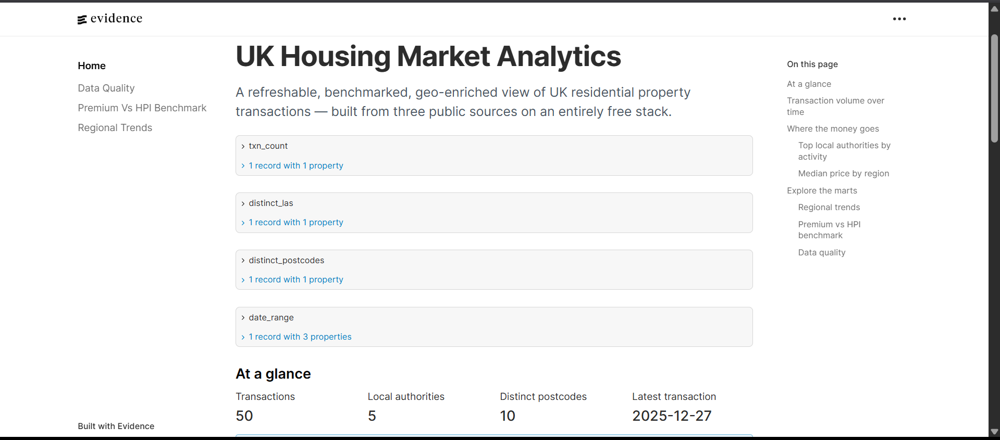
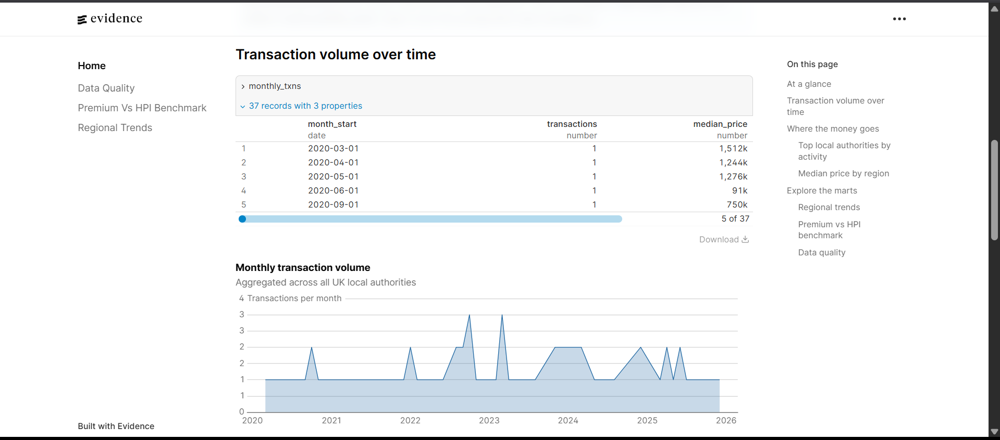
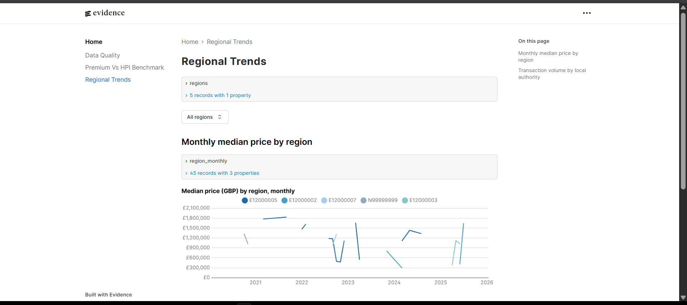
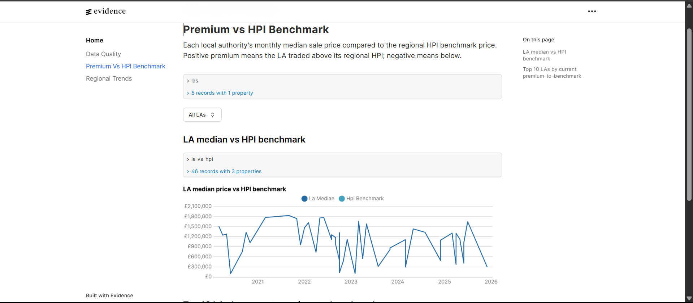
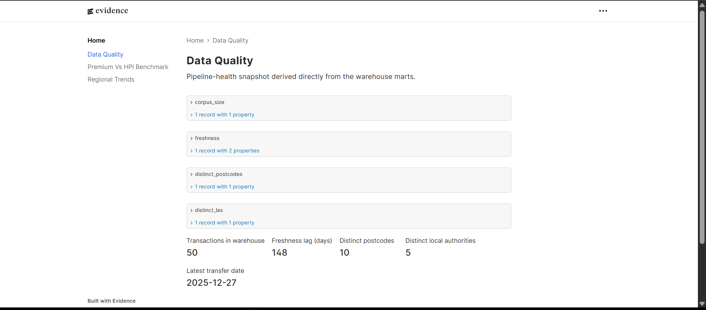

# UK Housing Market: Modern Data Stack

> A scheduled batch ELT pipeline that ingests UK Land Registry PPD, ONS NSPL, and UK HPI, models them through dbt against DuckDB (dev/CI) and BigQuery (prod), validates them with Great Expectations + dbt tests, and publishes an Evidence.dev analytics site to GitHub Pages.



---

## Hero Results

| Highlight | Value |
|---|---|
| Pipeline runtime (fixture mode, end-to-end) | **~4 min 30 s** (verified) |
| dbt models | **11** (3 staging · 2 intermediate · 4 core · 2 analytics) |
| dbt tests | **38** (generic + 3 singular) |
| Data-quality suites (Great Expectations) | **3** landing-zone suites + 1 checkpoint |
| BI deliverable | **Evidence.dev** static site → GitHub Pages (4 routes) |
| Fixture corpus (CI / dev) | **50 transactions · 10 postcodes · 5 local authorities** (date range 2020-03-14 to 2025-12-27) |

> **Note on metrics.** All numbers above are from the deterministic fixture corpus committed under `tests/fixtures/`. Production-warehouse metrics (full PPD backfill: ~27 M transactions; freshness lag; per-source row counts) will land after the first BigQuery run (see *Limitations & next steps*).

---

## The BI site

The pipeline's user-facing output is an Evidence.dev static site published to GitHub Pages. Four routes:

| Page | Screenshot |
|---|---|
| Homepage: headline stats + featured chart + navigation | [`01_home_hero.png`](reports/figures/01_home_hero.png) · [`02_home_charts.png`](reports/figures/02_home_charts.png) · [`03_home_nav.png`](reports/figures/03_home_nav.png) |
| Regional trends: region dropdown + monthly median price + LA volume | [`04_regional_trends.png`](reports/figures/04_regional_trends.png) |
| Premium vs HPI benchmark: LA dropdown + LA-vs-HPI line + top-10 premium table | [`05_premium_vs_benchmark.png`](reports/figures/05_premium_vs_benchmark.png) |
| Data quality: pipeline health BigValue cards | [`06_data_quality.png`](reports/figures/06_data_quality.png) |

<table>
<tr>
<td></td>
<td></td>
</tr>
<tr>
<td></td>
<td></td>
</tr>
</table>

---

## The Business Problem

UK residential property transactions are public data, but the relevant sources are fragmented across three government bodies and three formats. Anyone wanting to ask the obvious analytical questions, such as how transaction volumes in a given region have moved against the national HPI since a given year, or which local authorities are trading above or below their long-run HPI benchmark, first has to download multiple bulk files, reconcile postcode-to-geography lookups, join against a monthly index series, and re-run the whole process every time fresh data is published.

This pipeline solves that by producing a refreshed, benchmarked, geo-enriched warehouse of UK residential transactions on a fixed monthly schedule. The output is queryable two ways: directly against the published DuckDB file (downloaded as a GitHub Release asset) or against the public BigQuery dataset; or browsed through an Evidence.dev analytics site published to GitHub Pages.

The system runs end-to-end on free infrastructure: GitHub Actions cron for scheduling, BigQuery free tier for the production warehouse, and GitHub Pages for the BI site.

---

## What This Demonstrates

The repository structure points at the technical surface area:

- `flows/`: Prefect 2 orchestration (ingest → GE → load → dbt → Evidence)
- `dbt_project/models/`: five-layer dbt project (staging → intermediate → marts/core → marts/analytics)
- `dbt_project/tests/`: three singular tests for cross-table invariants
- `great_expectations/`: three landing-zone suites and a unifying checkpoint
- `evidence/`: Evidence.dev BI site (3 analysis pages + data quality page)
- `.github/workflows/`: CI (lint + tests + dbt build), monthly cron, Evidence publish

---

## Quick Start

```bash
# 1. Create venv (needs Python 3.11)
py -3.11 -m venv .venv
.venv\Scripts\activate
pip install -r requirements.txt

# 2. Generate fixture data
python scripts/build_fixtures.py
python -c "from pathlib import Path; from flows.tasks.ingest_ppd import ingest_ppd; ingest_ppd.fn(Path('data/landing/ppd'), mode='fixture')"
python -c "from pathlib import Path; from flows.tasks.ingest_nspl import ingest_nspl; ingest_nspl.fn(Path('data/landing/nspl'), mode='fixture')"
python -c "from pathlib import Path; from flows.tasks.ingest_hpi import ingest_hpi; ingest_hpi.fn(Path('data/landing/hpi'), mode='fixture')"
python scripts/load_fixtures_to_duckdb.py

# 3. dbt build (verifies the full DAG)
cp dbt_project/profiles.yml.example dbt_project/profiles.yml
cd dbt_project && dbt deps --profiles-dir . && dbt build --target duckdb --profiles-dir .

# 4. Optional: end-to-end flow smoke (also builds Evidence; ~5 min)
$env:RUN_SLOW="1"; python -m pytest tests/test_flows_smoke.py -v -s
```

---

## Project Structure

```
uk-housing-mds/
├── README.md                          ← 9-section per CONTRIBUTING.md
├── requirements.txt
├── pyproject.toml
├── .env.example
│
├── flows/                             ← Prefect flows and tasks
│   ├── monthly_refresh.py
│   ├── schedules.py
│   └── tasks/
│       ├── ingest_ppd.py
│       ├── ingest_nspl.py
│       ├── ingest_hpi.py
│       ├── load_warehouse.py
│       ├── warehouse_router.py
│       ├── run_dbt.py
│       ├── run_data_quality.py
│       └── build_evidence.py
│
├── dbt_project/
│   ├── dbt_project.yml
│   ├── profiles.yml.example           ← duckdb + bigquery profiles
│   ├── models/
│   │   ├── staging/                   ← stg_ppd, stg_nspl, stg_hpi
│   │   ├── intermediate/              ← int_nspl_current, int_ppd_enriched
│   │   └── marts/
│   │       ├── core/                  ← fct_transactions (incremental), dim_*
│   │       └── analytics/             ← mart_la_monthly_summary, mart_premium_to_benchmark
│   ├── tests/                         ← 3 singular tests
│   ├── macros/
│   └── seeds/
│
├── great_expectations/
│   ├── expectations/                  ← ppd / nspl / hpi landing suites
│   └── checkpoints/                   ← landing_all
│
├── evidence/
│   ├── pages/                         ← index, regional-trends, premium-vs-benchmark, data-quality
│   ├── sources/                       ← DuckDB connection + cached source SQL
│   └── package.json
│
├── src/housing_mds/                   ← Pure-Python helpers (download, parquet_io, postcode)
│
├── data/                              ← contents gitignored
│   ├── landing/                       ← parquet, per source per period
│   ├── duckdb/                        ← dev warehouse file
│   └── raw_archive/                   ← downloaded CSVs / ZIPs
│
├── tests/
│   ├── conftest.py
│   ├── fixtures/                      ← committed deterministic fixtures
│   └── test_*.py
│
├── scripts/                           ← build_fixtures.py, load_fixtures_to_duckdb.py
│
├── .github/workflows/
│   ├── ci.yml                         ← lint + pytest + dbt build (DuckDB)
│   ├── monthly-refresh.yml            ← cron 06:00 UTC on day 1
│   └── publish-evidence.yml           ← post-refresh GitHub Pages deploy
│
└── docs/
    └── 2026-05-23-uk-housing-mds-design.md
```

---

## Methodology

**Five-layer dbt project.** Data moves through `landing` (parquet on disk) → `raw` (1:1 warehouse copy of the parquet) → `staging` (typed, renamed, filtered) → `intermediate` (joined, geo-enriched) → `marts/core` (incremental fact + conformed dimensions) → `marts/analytics` (presentation-layer aggregates). Each layer has a single responsibility and is independently testable.

**PPD as an incremental fact table.** `fct_transactions` is materialised as a dbt `incremental` model with `unique_key='transaction_unique_id'` and `on_schema_change='fail'`, so monthly increments do not reprocess the full ~27 M-row history. The incremental window looks back 60 days from `MAX(transfer_date)` to catch late-publishing Land Registry transactions.

**NSPL as an effective-dated postcode lookup.** `int_nspl_current` exposes the most recent NSPL snapshot as the canonical postcode → LSOA / LA / region / IMD lookup. Historical postcodes still resolve against this snapshot; full SCD2 over quarterly NSPL snapshots is in the scaling path documented in the design doc §12.

**Three-layer data quality.** Great Expectations landing suites validate sources *before* any warehouse load (schema, value bounds, postcode regex, row-count band vs trailing-3-month median). dbt generic tests cover `unique` / `not_null` / `accepted_values` / `relationships` on every staging and mart model. Three singular dbt tests cover cross-table invariants: no future transfer dates, premium-to-benchmark within [-80 %, +500 %], monthly row count within 3σ of trailing median.

**Dual-warehouse profile switching.** A single dbt codebase targets DuckDB (development, CI, distributable artefact) and BigQuery (production scheduled runs). `dbt_project/profiles.yml.example` defines both outputs; the active target is selected by `--target duckdb` / `--target bigquery` from the Prefect flow.

**Quota-aware fallback.** `flows/tasks/warehouse_router.py` attempts BigQuery first when `target_pref="bigquery"`. If the load job raises `BigQueryFreeTierExhausted` (the wrapper for BigQuery's `quotaExceeded` job error), the flow logs a warning, falls back to DuckDB for that run, and tags the run with the target that actually executed. Next scheduled run retries BigQuery.

**Evidence.dev source materialization.** Evidence pages query a pre-materialised parquet cache built from `evidence/sources/*.sql` against the warehouse, not the live warehouse directly. This keeps page loads fast on GitHub Pages and gives the build a single, deterministic SQL surface to test against in CI. SQL behind every chart is rendered on each page per Evidence convention.

---

## Tech Stack

| Layer | Tool | Justification |
|---|---|---|
| Ingestion | Python + `requests` + `pyarrow` | Bulk CSVs land as partitioned Parquet for warehouse parity between DuckDB and BigQuery. |
| Orchestration | Prefect 2 (local execution mode) | Task retries, structured logging, parametrised flows, no hosted-server dependency. |
| Warehouse (dev / CI) | DuckDB | Single-file embedded warehouse; identical SQL surface to BigQuery for the modelled layers; fast local iteration. |
| Warehouse (production) | BigQuery free tier | Real cloud warehouse, free at the project's data volume (well inside the 1 TB / month query allowance). |
| Transformation | dbt (`dbt-duckdb`, `dbt-bigquery`) | Profile switching gives the dual-warehouse target from one codebase. |
| Data quality (landing) | Great Expectations | Source-side schema and value validation before any warehouse load. |
| Data quality (warehouse) | dbt tests (generic + singular) | Cross-table and in-warehouse invariants. |
| BI / serving | Evidence.dev → GitHub Pages | SQL-first, code-in-repo, free public URL. |
| Lint | `ruff`, `sqlfluff` | Python and SQL style consistency. |
| CI / scheduling | GitHub Actions | Free for public repos; runs both CI and monthly cron. |

---

## Limitations & Next Steps

- **NSPL and HPI source URLs are currently `TBD`** in the ingest modules; only fixture mode is verified end-to-end. The real-data backfill requires verifying the latest ONS Open Geography Portal and Land Registry HPI publication URLs before the first production run.
- **BigQuery setup pending.** The production target requires a GCP project and a service-account key (`GCP_SA_KEY` + `BQ_PROJECT_ID` repo Secrets). The free tier is sufficient for the project's data volume; the flow falls back to DuckDB automatically if `GCP_SA_KEY` is absent.
- **`mart_pipeline_health` not built.** Evidence's data-quality page currently surfaces three warehouse-derivable metrics (corpus size, freshness lag, distinct postcodes / LAs). Full run-success-rate and test-pass-rate tracking are deferred until the `mart_pipeline_health` model is built against dbt's `run_results.json` artefact.
- **NSPL loaded as snapshot, not SCD2.** Historical postcode resolution uses the current geography rather than the geography in force at transaction time. SCD2 over quarterly NSPL snapshots is in the scaling path (design doc §12).
- **Out of scope (intentionally):** streaming / change-data-capture ingestion, reverse-ETL (Slack / Sheet alerts), predictive modelling on top of the marts, authenticated or per-user views on the Evidence site, sub-monthly freshness.
